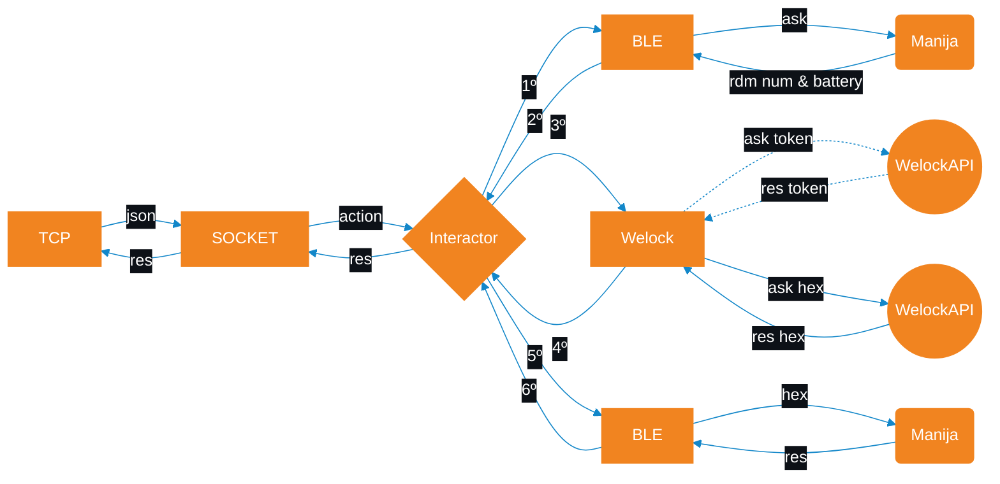

# BleKotlin

## Aplicación para domotizar las viviendas.

Author

**JazBass**

*Android Developer*

All rights reserved ®

[Find me on LinkedIn](https://www.linkedin.com/in/jazbass/)

### Importante
```
Antes de instalar configurar en com.mch.blekot.common.Constants:
* 'const val ID' con el nombre del piso al que irá para la conexion por socket, debe coincidir con el código
 del piso en BBDD

En Android Studio luego de setear el ID en la pestaña Build, al hacer click en la sección Build Bundle / APK 
se genera el APK que podrá instalar en el móvil.
```
### Parámetros

Recibe un solo json y todos los valores en string
Los parámetros que debe recibir el móvil son los siguientes, entre comillas la clave:

En todas las peticiones:
```
identificador que nos asigna el TCP  = "clientFrom"  
La acción a realizar = "cmd" pueden ser:

"openLock"
"newCode"
"setCard"
"syncTime"
"openPortal"
```
Para en el caso de open portal además:
```
La IP del arduino = "ipArduino"
```
Para acciones con la manija:
```
Mac address de la manija = "macAddress"
ID de la manija = "deviceId"
Bluetooth name de la manija ="deviceName"
```
Y además para new code
```
Dias de duración = "days"
El nuevo código = "code"
Index donde se almacenará = "index"
cantidad de veces que se podrá usar  = "times"
```

Y para set card

 ```
El QR de la llave = "qr"
El tipo de acción = "type" siento 1 para agregar y 2 para eliminar
```

### Respuestas

Las respuestas son en formato **json** y se crean en com.mch.blekot.common.JsonManager.kt. Cuando se
envía la respuesta a través de la función com.mch.blekot.model.socket.SocketSingleton.emitResponse()
es cuando se da por finalizada una acción (isProcessActive = false) y el móvil queda listo para
recibir una nueva petición. Es **Muy importante** que tanto en los posibles errores, como en las
acciones realizadas exitosamente se llame a ésta función.

En caso de éxito el valor de **status** será **1**, en caso de error los valores pueden ser:

```
 0 --> Hay una petición pendiente
-1 --> Error no especificado
-2 --> Falta enviar un parametro desde el socket
-3 --> Error en la validación de los parámetros, en la respuesta se especifica que valor estaba erróneo 
-4 --> El bluetooth del móvil no está encendido
-5 --> Se ha agotado el tiempo de escaneo de bluetooth
-6 --> Se ha agotado el tiempo para procesar una petición
-7 --> Error en la respuesta de WeLock-API, puede que los parámetros sean erróneos o que la manija no 
esté activada
```

Además, en la respuesta podemos devolver información reelevante como:

```
"msg": Información
"clientFrom": El nombre (ID) del móvil
"startTime": Por ejemplo de validez
"endTime": Idem
"lockBattery": La bateria restante en la manija
"date" : Fecha de la petición
```


### Tiempos de espera
```
Cada petición tiene un máximo de 3 minutos para ser gestionada, en caso de superar este tiempo se cancelará la 
función y se avisará al TCP

El escaneo tiene un máximo de duración de 30 segundos, por lo general no tarda más de 1 segundo en 
encontrar el móvil, por lo que si este error se repite reiteradas veces es probable que haya un 
problema con la manija ya que el móvil no está localizándola.
```

### El flujo de la app sería algo así


Y así queridos amigos de MCH me despido.


